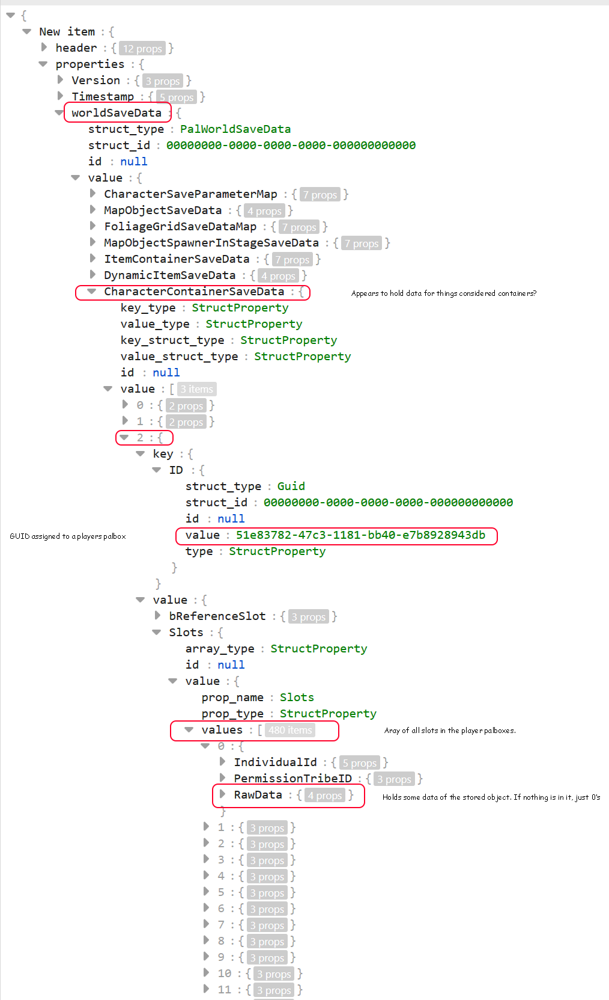

# Palworld-Palbox-Slot-Injector
Injects slots into existing players palboxes. Allows you to increase the amount of possible slots you can have in the boxes. It does not, however, allow you to access those slots without a mod.

Works alongside a mod like: https://www.nexusmods.com/palworld/mods/68  
You can edit the main.lua script this mod comes with to edit the box count and slot sizes  

How this works is under the how to use and notes  

**Tools needed:**  
Python installed  
Palworld-Save-Tools: https://github.com/cheahjs/palworld-save-tools/  

**How to use:**  
1. Run "Palworld-Save-Tools" against "Level.sav" to get "Level.sav.json" in the directory  
2. In save "Players" folder, run "Palworld-Save-Tools" against all player .sav so that you have x.sav.json  
- eg. "00000000000000000000000000000001.sav" -> "00000000000000000000000000000001.sav.json"  
3. In "config.ini" in script folder, modify "boxcount" number to desired box number and "boxslotcount" to desired slots per box  
4. Drag your "Level.sav.json" onto the "inject_box_slots.cmd" or command line it  
- Must be "**Level.sav.json**" not "Level.sav"  
5. Install a mod like previously stated "Bigger and Reorganized PalBox" to allow displaying of the new box slots  
- Modify the "main.lua" that comes from "Bigger and Reorganized PalBox" so that  
- - "PalGameSetting.PalBoxPageNum" is the same as "boxcount" in "config.ini"  
- - "PalGameSetting.PalBoxSlotNumInPage" is the same as "boxslotcount" in "config.ini"

It will automatically read player .sav.json's in the Players folder to find their palbox guid and inject box slots to the required amount  

**Dedicated Server**  
At the time of writing this, this appears to be able to be ran on a dedicated server but I haven't done it myself so only limited knowledge on the process.  
You can inject mods into a dedicated server with:  
https://github.com/N00byKing/PalWorld-ServerInjector  
With this installed, the most recent mods by "yakuzadeso" on NexusMods includes a "ue4ss signatures" archive. Replacing the server injector with these updated signatures appears to make it work.  
https://www.nexusmods.com/palworld/users/63907421?tab=user+files  
If Palworld updates this may prevent you from running dedicated with mods and thus not being able to use the saves changes this makes. This could potentially break the save if you run without the mods so be aware of this.  

**Notes:**  
I am unaware of what possible issues this could cause so use with caution and awareness this may break something and be irreversible. It already backups level.sav.json but be sure to do it yourself.  

**How this works**  
Game appears to work by having slots be an ordered array containing box slots in a contiguous order. How many slots you have is based on box count * slots per box. Based on these parameters, you can just inject new slots to the save based on your desired box count and slots per boxes setup in a mod like the previously listed.  

More technical explanation for those who want to expand this making something not as crappy:  

In each player saves, under the property "PalStorageContainerId", players are assigned a GUID that relates to a "PalCharacterSlotSaveData" object. This object resides inside the Lavel.sav "worldSaveData" -> "CharacterContainerSaveData". I'm not sure what the purpose of the non-player ones in here are but every player will have their palbox as one of the objects in its value array. Inside the containers "Slots" Property will be an array of box slots. The game internally just stores palbox slots as a single array and on the UI side it handles how to distribute them out to boxes.  

Pals are stored in savs in "CharacterSaveParameterMap" property. Each pal has a SlotID property and this assigns them a ContainerId(The palbox) and then a SlotIndex. The SlotIndex from my quick play just points them to the absolute position on the box stack so the UI can determine which box they get visually represented with.  

With this, you can increase slots per box by more than 30 (it does display this correctly with a scroll bar) and it won't have any issues. I didn't test it myself but if you increase amount of slots in a box it means the pals should be pushed up the visual stack so those on box 2 will show up on box 1 now etc.

You can do things like having a single slot only existing but 30 boxes. In this situation, the container array will only have a single entry. So visually, you will see the first box having a single slot and the rest having none. Likewise, you can having the final box be cutoff short on its slot count by assigning a bit of objects to the container array.

TL;DR:
Save holds how many potential box slots a player can have, the game itself (or the bigger palbox mod) determines how many slots the UI will actually display to access. If the save holds less slots than attempting to display, it will just show the missing as unaccessable (More testing should be done here to ensure it won't attempt to access things that don't exist). If the save holds more than the UI is told to display, it will simply not display them (More testing here should be done to check if this could cause save corruption).

